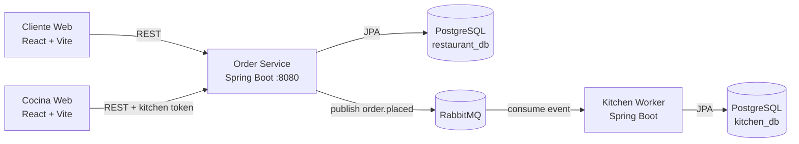
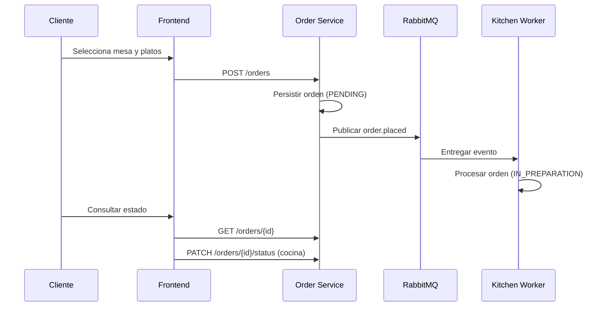

# Sistema de Pedidos de Restaurante - Backend

## Requisitos previos

### Clonar ambos repositorios

Este proyecto requiere **dos repositorios independientes**:

```bash
# Repositorio del backend
git clone <url-backend-repo> Sistemas-de-pedidos-restaurante-backend

# Repositorio del frontend
git clone <url-frontend-repo> Sistemas-de-pedidos-restaurante-frontend
```

Crear una carpeta padre que contenga ambos:

```
proyectos/
├── Sistemas-de-pedidos-restaurante-backend/   # Backend repo
│   ├── order-service/
│   ├── kitchen-worker/
│   ├── report-service/
│   ├── pom.xml
│   └── ...
└── Sistemas-de-pedidos-restaurante-frontend/  # Frontend repo
    ├── src/
    ├── package.json
    └── ...
```

## Estado actual

- Rama objetivo de trabajo: `develop`
- Modo por defecto para produccion: **API real** (`VITE_USE_MOCK=false`)
- Stack completo en contenedores: frontend, order-service, kitchen-worker, postgres (x3), rabbitmq

## Arquitectura



## Flujo principal



## Quickstart con Docker (recomendado)

### Setup inicial

1. **Requisitos:**
   - Docker Desktop en ejecucion
   - Puertos libres: `5173`, `8080`, `5432`, `5433`, `5434`, `5672`, `15672`

2. **Crear archivos de configuracion en la carpeta raiz (fuera de los repos):**

Crear la estructura:
```
proyectos/
├── docker-compose.yml          # (crear aqui)
├── docker-compose.dev.yml      # (crear aqui)
├── .env                        # (crear aqui)
├── Sistemas-de-pedidos-restaurante-backend/
└── Sistemas-de-pedidos-restaurante-frontend/
```

3. **Copiar archivos docker-compose:**

**`docker-compose.yml`** (ambiente produccion):
```yaml
x-common-config: &common-config
  env_file:
    - .env
  networks:
    - restaurant-net

services:
  # --- BASES DE DATOS ---
  postgres:
    <<: *common-config
    image: postgres:15
    container_name: restaurant-postgres
    environment:
      POSTGRES_DB: ${POSTGRES_DB:-restaurant_db}
      POSTGRES_USER: ${POSTGRES_USER:-restaurant_user}
      POSTGRES_PASSWORD: ${POSTGRES_PASSWORD:-restaurant_pass}
    ports:
      - "5432:5432"
    volumes:
      - postgres_data:/var/lib/postgresql/data
    healthcheck:
      test: ["CMD-SHELL", "pg_isready -U $${POSTGRES_USER:-restaurant_user} -d $${POSTGRES_DB:-restaurant_db}"]
      interval: 10s
      timeout: 5s
      retries: 5

  kitchen-postgres:
    <<: *common-config
    image: postgres:15
    container_name: kitchen-postgres
    environment:
      POSTGRES_DB: ${KITCHEN_POSTGRES_DB:-kitchen_db}
      POSTGRES_USER: ${KITCHEN_POSTGRES_USER:-kitchen_user}
      POSTGRES_PASSWORD: ${KITCHEN_POSTGRES_PASSWORD:-kitchen_pass}
    ports:
      - "5433:5432"
    volumes:
      - kitchen_postgres_data:/var/lib/postgresql/data
    healthcheck:
      test: ["CMD-SHELL", "pg_isready -U $${KITCHEN_POSTGRES_USER:-kitchen_user} -d $${KITCHEN_POSTGRES_DB:-kitchen_db}"]
      interval: 10s
      timeout: 5s
      retries: 5

  report-postgres:
    <<: *common-config
    image: postgres:15
    container_name: report-postgres
    environment:
      POSTGRES_DB: ${REPORT_POSTGRES_DB:-report_db}
      POSTGRES_USER: ${REPORT_POSTGRES_USER:-report_user}
      POSTGRES_PASSWORD: ${REPORT_POSTGRES_PASSWORD:-report_pass}
    ports:
      - "5434:5432"
    volumes:
      - report_postgres_data:/var/lib/postgresql/data
    healthcheck:
      test: ["CMD-SHELL", "pg_isready -U $${REPORT_POSTGRES_USER:-report_user} -d $${REPORT_POSTGRES_DB:-report_db}"]
      interval: 10s
      timeout: 5s
      retries: 5

  # --- MENSAJERÍA ---
  rabbitmq:
    <<: *common-config
    image: rabbitmq:3-management
    container_name: restaurant-rabbitmq
    ports:
      - "5672:5672"
      - "15672:15672"
    environment:
      RABBITMQ_DEFAULT_USER: ${RABBITMQ_USER:-guest}
      RABBITMQ_DEFAULT_PASS: ${RABBITMQ_PASS:-guest}
    volumes:
      - rabbitmq_data:/var/lib/rabbitmq
    healthcheck:
      test: ["CMD", "rabbitmq-diagnostics", "ping"]
      interval: 10s
      timeout: 5s
      retries: 5

  # --- MICROSERVICIOS SPRING BOOT ---
  order-service:
    <<: *common-config
    build:
      context: ./Sistemas-de-pedidos-restaurante-backend
      dockerfile: order-service/Dockerfile
    container_name: restaurant-order-service
    ports:
      - "8080:8080"
    depends_on:
      postgres:
        condition: service_healthy
      rabbitmq:
        condition: service_healthy

  kitchen-worker:
    <<: *common-config
    build:
      context: ./Sistemas-de-pedidos-restaurante-backend
      dockerfile: kitchen-worker/Dockerfile
    container_name: restaurant-kitchen-worker
    ports:
      - "8081:8081"
    depends_on:
      kitchen-postgres:
        condition: service_healthy
      rabbitmq:
        condition: service_healthy

  report-service:
    <<: *common-config
    build:
      context: ./Sistemas-de-pedidos-restaurante-backend
      dockerfile: report-service/Dockerfile
    container_name: restaurant-report-service
    ports:
      - "8082:8082"
    depends_on:
      report-postgres:
        condition: service_healthy
      rabbitmq:
        condition: service_healthy

  # --- FRONTEND ---
  frontend:
    <<: *common-config
    build:
      context: ./Sistemas-de-pedidos-restaurante-frontend
      dockerfile: Dockerfile.frontend
    container_name: restaurant-frontend
    ports:
      - "5173:5173"
    depends_on:
      - order-service

volumes:
  postgres_data:
  kitchen_postgres_data:
  report_postgres_data:
  rabbitmq_data:

networks:
  restaurant-net:
    driver: bridge
```

**`docker-compose.dev.yml`** (override para desarrollo con hot-reload):
```yaml
services:
  order-service:
    build:
      context: ./Sistemas-de-pedidos-restaurante-backend
      dockerfile: order-service/Dockerfile.dev
    volumes:
      - ./Sistemas-de-pedidos-restaurante-backend/order-service/src:/app/order-service/src
      - maven_cache:/root/.m2
    environment:
      SPRING_DEVTOOLS_RESTART_ENABLED: "true"
      SPRING_DEVTOOLS_LIVERELOAD_ENABLED: "true"

  kitchen-worker:
    build:
      context: ./Sistemas-de-pedidos-restaurante-backend
      dockerfile: kitchen-worker/Dockerfile.dev
    volumes:
      - ./Sistemas-de-pedidos-restaurante-backend/kitchen-worker/src:/app/kitchen-worker/src
      - maven_cache:/root/.m2
    environment:
      SPRING_DEVTOOLS_RESTART_ENABLED: "true"
      SPRING_DEVTOOLS_LIVERELOAD_ENABLED: "true"

  report-service:
    build:
      context: ./Sistemas-de-pedidos-restaurante-backend
      dockerfile: report-service/Dockerfile.dev
    volumes:
      - ./Sistemas-de-pedidos-restaurante-backend/report-service/src:/app/report-service/src
      - maven_cache:/root/.m2
    environment:
      SPRING_DEVTOOLS_RESTART_ENABLED: "true"
      SPRING_DEVTOOLS_LIVERELOAD_ENABLED: "true"

  frontend:
    build:
      context: ./Sistemas-de-pedidos-restaurante-frontend
      dockerfile: Dockerfile.frontend.dev
    volumes:
      - ./Sistemas-de-pedidos-restaurante-frontend:/app
      - /app/node_modules
    environment:
      CHOKIDAR_USEPOLLING: "true"

volumes:
  maven_cache:
```

**`.env`** (en la carpeta raiz):
```bash
SERVER_PORT=8080
DB_URL=jdbc:postgresql://postgres:5432/restaurant_db
DB_USER=restaurant_user
DB_PASS=restaurant_pass
KITCHEN_TOKEN_HEADER=X-Kitchen-Token
KITCHEN_AUTH_TOKEN=cocina123

# CORS Configuration
CORS_ALLOWED_ORIGINS=http://localhost:5173,http://127.0.0.1:5173
# CORS_ALLOWED_ORIGIN_PATTERNS=https://*.trycloudflare.com

# ========================================
# KITCHEN WORKER
# ========================================
KITCHEN_WORKER_PORT=8081
KITCHEN_DB_URL=jdbc:postgresql://kitchen-postgres:5432/kitchen_db
KITCHEN_DB_USER=kitchen_user
KITCHEN_DB_PASS=kitchen_pass

# ========================================
# REPORT SERVICE
# ========================================
REPORT_SERVICE_PORT=8082
REPORT_DB_URL=jdbc:postgresql://report-postgres:5432/report_db
REPORT_DB_USER=report_user
REPORT_DB_PASS=report_pass

# ========================================
# RABBITMQ CONFIGURATION
# ========================================
RABBITMQ_HOST=rabbitmq
RABBITMQ_PORT=5672
RABBITMQ_USER=guest
RABBITMQ_PASS=guest

# Exchange and Routing Keys
RABBITMQ_EXCHANGE_NAME=order.exchange
RABBITMQ_ROUTING_KEY_ORDER_PLACED=order.placed
RABBITMQ_DLQ_ROUTING_KEY=order.placed.failed

# Kitchen Worker Queues
RABBITMQ_KITCHEN_QUEUE_NAME=order.placed.queue
RABBITMQ_KITCHEN_DLQ_NAME=order.placed.dlq
RABBITMQ_KITCHEN_DLX_NAME=order.dlx

# Report Service Queues
RABBITMQ_REPORT_QUEUE_NAME=order.placed.report.queue
RABBITMQ_REPORT_ORDER_READY_QUEUE_NAME=order.ready.report.queue
RABBITMQ_REPORT_DLQ_NAME=order.placed.report.dlq
RABBITMQ_REPORT_DLX_NAME=order.report.dlx
RABBITMQ_ROUTING_KEY_ORDER_READY=order.ready

# ========================================
# POSTGRES DATABASES
# ========================================
POSTGRES_DB=restaurant_db
POSTGRES_USER=restaurant_user
POSTGRES_PASSWORD=restaurant_pass

KITCHEN_POSTGRES_DB=kitchen_db
KITCHEN_POSTGRES_USER=kitchen_user
KITCHEN_POSTGRES_PASSWORD=kitchen_pass

REPORT_POSTGRES_DB=report_db
REPORT_POSTGRES_USER=report_user
REPORT_POSTGRES_PASSWORD=report_pass


4. **Ejecutar desde la carpeta raiz:**

```bash
# Iniciar el stack (produccion)
docker compose -f docker-compose.yml -f docker-compose.dev.yml up -d --build

# Ver estado de contenedores
docker compose ps

# Ver logs de un servicio
docker compose logs -f frontend
```

### Dockerfiles de referencia

**`Dockerfile.frontend`** (produccion):
```dockerfile
FROM node:20-alpine AS deps
WORKDIR /app
COPY package.json package-lock.json* ./
RUN npm ci || npm i

FROM node:20-alpine AS build
WORKDIR /app
COPY --from=deps /app/node_modules ./node_modules
COPY . .
RUN npm run build

FROM node:20-alpine AS runner
WORKDIR /app
ENV NODE_ENV=production
COPY --from=build /app/dist ./dist
COPY package.json ./
RUN npm i --omit=dev=false
EXPOSE 8080
CMD ["npm", "run", "preview"]
```

**`Dockerfile.frontend.dev`** (desarrollo con hot-reload):
```dockerfile
FROM node:20-alpine
WORKDIR /app
COPY package.json package-lock.json* ./
RUN npm ci || npm i
EXPOSE 5173
CMD ["npm", "run", "dev", "--", "--host", "0.0.0.0"]
```

### URLs del stack

Tras ejecutar `docker compose up`:

- **Frontend cliente**: http://localhost:5173
- **Frontend cocina**: http://localhost:5173/kitchen
- **API Order Service**: http://localhost:8080
- **API Swagger**: http://localhost:8080/swagger-ui.html
- **RabbitMQ UI**: http://localhost:15672 (guest/guest)
- **Kitchen Worker**: http://localhost:8081
- **Report Service**: http://localhost:8082

Detener stack:

```bash
docker compose down
```

Detener y limpiar (eliminar volumenes):

```bash
docker compose down -v
```

## Modos de ejecucion

Variables frontend clave:
- `VITE_USE_MOCK=false` (default recomendado para `main`)
- `VITE_ALLOW_MOCK_FALLBACK=false` (sin fallback silencioso)
- `VITE_API_BASE_URL=http://localhost:8080`

Resumen:
- Modo real: `VITE_USE_MOCK=false` (usa backend y RabbitMQ)
- Modo mock dev: `VITE_USE_MOCK=true` (solo para desarrollo local)
- Fallback controlado: `VITE_ALLOW_MOCK_FALLBACK=true` (solo contingencia)

## Seguridad de cocina

Configuracion esperada:
- Header: `X-Kitchen-Token`
- Token/PIN por defecto: `cocina123`

Variables:
- Backend: `KITCHEN_TOKEN_HEADER`, `KITCHEN_AUTH_TOKEN`
- Frontend: `VITE_KITCHEN_TOKEN_HEADER`, `VITE_KITCHEN_PIN`, `VITE_KITCHEN_FIXED_TOKEN`

## Smoke test minimo

Desde la carpeta raiz con Docker corriendo:

```bash
# Menu
curl http://localhost:8080/menu

# Crear orden
curl -X POST http://localhost:8080/orders \
  -H "Content-Type: application/json" \
  -d '{"tableId":12,"items":[{"productId":1,"quantity":2},{"productId":8,"quantity":1}]}'

# Listar ordenes activas (desde cocina)
curl "http://localhost:8080/orders?status=PENDING,IN_PREPARATION,READY" \
  -H "X-Kitchen-Token: cocina123"
```

## Documentacion canonica

- Guia operativa rapida: `docs/development/GUIA_RAPIDA.md`
- Auditoria fase 1 (consolidada): `docs/auditoria/AUDITORIA.md`
- Calidad y pruebas (consolidado): `docs/quality/CALIDAD.md`
- Deuda tecnica (consolidada): `docs/quality/DEUDA_TECNICA.md`

## Estructura del repositorio

```
Sistemas-de-pedidos-restaurante-frontend/
├── src/
│   ├── api/                 # Llamadas HTTP al backend
│   ├── app/                 # Contextos y providers
│   ├── components/          # Componentes React reutilizables
│   ├── domain/              # Tipos y interfaces
│   ├── pages/               # Paginas (cliente, cocina, etc)
│   ├── store/               # Estado global (Zustand)
│   ├── test/                # Fixtures y mocks
│   ├── App.tsx              # Routing principal
│   ├── main.tsx             # Entry point
│   └── styles.css           # Estilos globales
├── public/                  # Assets estaticos
├── scripts/                 # Helpers (docker, smoke tests)
├── docs/                    # Documentacion
│   ├── development/         # Guias rapidas
│   ├── quality/             # Calidad y deuda tecnica
│   └── auditoria/           # Auditorias
├── package.json             # Dependencias Node
├── vite.config.ts           # Configuracion Vite
├── Dockerfile.frontend      # Produccion
├── Dockerfile.frontend.dev  # Desarrollo
└── README.md                # Este archivo
```

## Desarrollo local sin Docker

Para desarrollo local sin Docker:

```bash
# Instalar dependencias
npm install

# Iniciar servidor dev (hot-reload)
npm run dev

# Compilar para produccion
npm run build

# Vista previa de build
npm run preview
```

Requiere:
- Node.js 20+
- npm/yarn
- Backend ejecutándose en http://localhost:8080