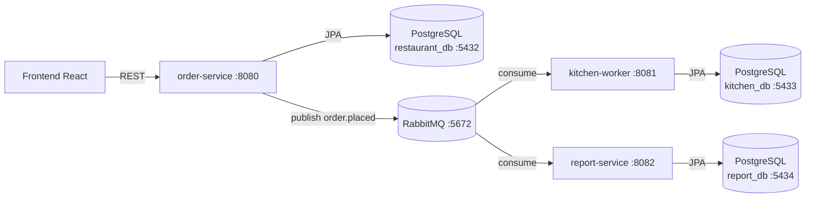

# Sistema de Pedidos de Restaurante — Backend

Backend del sistema de pedidos, compuesto por tres microservicios Java 17 / Spring Boot 3.2 con bases de datos separadas y comunicacion asincrona via RabbitMQ.

## Arquitectura



| Servicio | Responsabilidad | Puerto |
|----------|----------------|--------|
| **order-service** | API REST, persistir ordenes, publicar eventos | 8080 |
| **kitchen-worker** | Consumir eventos AMQP, proyectar ordenes en cocina | 8081 |
| **report-service** | Consumir eventos AMQP, generar reportes | 8082 |

### Reglas de comunicacion

- Frontend ↔ order-service: **REST**
- order-service → kitchen-worker / report-service: **RabbitMQ** (evento `order.placed`)
- **Prohibido**: llamadas REST directas entre servicios backend

## Levantar el proyecto con Docker

### Requisitos

- Docker Desktop instalado y corriendo
- Puertos libres: `5173`, `8080`, `8081`, `8082`, `5432`, `5433`, `5434`, `5672`, `15672`

### 1. Clonar ambos repositorios en una carpeta comun

```bash
mkdir Sistemas-de-pedidos-restaurante && cd Sistemas-de-pedidos-restaurante

git clone <url-backend> Sistemas-de-pedidos-restaurante-backend
git clone <url-frontend> Sistemas-de-pedidos-restaurante-frontend
```

Resultado esperado:

```
Sistemas-de-pedidos-restaurante/          # carpeta raiz
├── docker-compose.yml                    # orquestacion de servicios
├── docker-compose.dev.yml                # override para hot-reload (opcional)
├── .env                                  # variables de entorno
├── Sistemas-de-pedidos-restaurante-backend/
│   ├── order-service/
│   ├── kitchen-worker/
│   ├── report-service/
│   └── pom.xml
└── Sistemas-de-pedidos-restaurante-frontend/
    ├── src/
    └── package.json
```

### 2. Crear el archivo `.env` en la carpeta raiz

Crear el archivo `Sistemas-de-pedidos-restaurante/.env` con el siguiente contenido:

```dotenv
# ========================================
# ORDER SERVICE
# ========================================
SERVER_PORT=8080
DB_URL=jdbc:postgresql://postgres:5432/restaurant_db
DB_USER=restaurant_user
DB_PASS=restaurant_pass
KITCHEN_TOKEN_HEADER=X-Kitchen-Token
KITCHEN_AUTH_TOKEN=cocina123

# CORS — origenes permitidos para el frontend
CORS_ALLOWED_ORIGINS=http://localhost:5173,http://127.0.0.1:5173

# ========================================
# KITCHEN WORKER
# ========================================
KITCHEN_WORKER_PORT=8081
KITCHEN_DB_URL=jdbc:postgresql://kitchen-postgres:5432/kitchen_db
KITCHEN_DB_USER=kitchen_user
KITCHEN_DB_PASS=kitchen_pass

# ========================================
# REPORT SERVICE
# ========================================
REPORT_SERVICE_PORT=8082
REPORT_DB_URL=jdbc:postgresql://report-postgres:5432/report_db
REPORT_DB_USER=report_user
REPORT_DB_PASS=report_pass

# ========================================
# RABBITMQ
# ========================================
RABBITMQ_HOST=rabbitmq
RABBITMQ_PORT=5672
RABBITMQ_USER=guest
RABBITMQ_PASS=guest

# Exchange y Routing Keys
RABBITMQ_EXCHANGE_NAME=order.exchange
RABBITMQ_ROUTING_KEY_ORDER_PLACED=order.placed
RABBITMQ_ROUTING_KEY_ORDER_READY=order.ready
RABBITMQ_DLQ_ROUTING_KEY=order.placed.failed

# Colas Kitchen Worker
RABBITMQ_KITCHEN_QUEUE_NAME=order.placed.queue
RABBITMQ_KITCHEN_DLQ_NAME=order.placed.dlq
RABBITMQ_KITCHEN_DLX_NAME=order.dlx

# Colas Report Service
RABBITMQ_REPORT_QUEUE_NAME=order.placed.report.queue
RABBITMQ_REPORT_ORDER_READY_QUEUE_NAME=order.ready.report.queue
RABBITMQ_REPORT_DLQ_NAME=order.placed.report.dlq
RABBITMQ_REPORT_DLX_NAME=order.report.dlx

# ========================================
# BASES DE DATOS POSTGRES (contenedores Docker)
# ========================================
POSTGRES_DB=restaurant_db
POSTGRES_USER=restaurant_user
POSTGRES_PASSWORD=restaurant_pass

KITCHEN_POSTGRES_DB=kitchen_db
KITCHEN_POSTGRES_USER=kitchen_user
KITCHEN_POSTGRES_PASSWORD=kitchen_pass

REPORT_POSTGRES_DB=report_db
REPORT_POSTGRES_USER=report_user
REPORT_POSTGRES_PASSWORD=report_pass
```

> **Nota:** Las variables `POSTGRES_*` / `KITCHEN_POSTGRES_*` / `REPORT_POSTGRES_*` las usan los contenedores PostgreSQL para crear las bases de datos. Las variables `DB_*` / `KITCHEN_DB_*` / `REPORT_DB_*` son las que usan los servicios Spring Boot para conectarse.

### 3. Crear el archivo `docker-compose.yml` en la carpeta raiz

```yaml
x-common-config: &common-config
  env_file:
    - .env
  networks:
    - restaurant-net

services:
  postgres:
    <<: *common-config
    image: postgres:15
    container_name: restaurant-postgres
    environment:
      POSTGRES_DB: ${POSTGRES_DB:-restaurant_db}
      POSTGRES_USER: ${POSTGRES_USER:-restaurant_user}
      POSTGRES_PASSWORD: ${POSTGRES_PASSWORD:-restaurant_pass}
    ports:
      - "5432:5432"
    volumes:
      - postgres_data:/var/lib/postgresql/data
    healthcheck:
      test: ["CMD-SHELL", "pg_isready -U $${POSTGRES_USER:-restaurant_user} -d $${POSTGRES_DB:-restaurant_db}"]
      interval: 10s
      timeout: 5s
      retries: 5

  kitchen-postgres:
    <<: *common-config
    image: postgres:15
    container_name: kitchen-postgres
    environment:
      POSTGRES_DB: ${KITCHEN_POSTGRES_DB:-kitchen_db}
      POSTGRES_USER: ${KITCHEN_POSTGRES_USER:-kitchen_user}
      POSTGRES_PASSWORD: ${KITCHEN_POSTGRES_PASSWORD:-kitchen_pass}
    ports:
      - "5433:5432"
    volumes:
      - kitchen_postgres_data:/var/lib/postgresql/data
    healthcheck:
      test: ["CMD-SHELL", "pg_isready -U $${KITCHEN_POSTGRES_USER:-kitchen_user} -d $${KITCHEN_POSTGRES_DB:-kitchen_db}"]
      interval: 10s
      timeout: 5s
      retries: 5

  report-postgres:
    <<: *common-config
    image: postgres:15
    container_name: report-postgres
    environment:
      POSTGRES_DB: ${REPORT_POSTGRES_DB:-report_db}
      POSTGRES_USER: ${REPORT_POSTGRES_USER:-report_user}
      POSTGRES_PASSWORD: ${REPORT_POSTGRES_PASSWORD:-report_pass}
    ports:
      - "5434:5432"
    volumes:
      - report_postgres_data:/var/lib/postgresql/data
    healthcheck:
      test: ["CMD-SHELL", "pg_isready -U $${REPORT_POSTGRES_USER:-report_user} -d $${REPORT_POSTGRES_DB:-report_db}"]
      interval: 10s
      timeout: 5s
      retries: 5

  rabbitmq:
    <<: *common-config
    image: rabbitmq:3-management
    container_name: restaurant-rabbitmq
    ports:
      - "5672:5672"
      - "15672:15672"
    environment:
      RABBITMQ_DEFAULT_USER: ${RABBITMQ_USER:-guest}
      RABBITMQ_DEFAULT_PASS: ${RABBITMQ_PASS:-guest}
    volumes:
      - rabbitmq_data:/var/lib/rabbitmq
    healthcheck:
      test: ["CMD", "rabbitmq-diagnostics", "ping"]
      interval: 10s
      timeout: 5s
      retries: 5

  order-service:
    <<: *common-config
    image: ghcr.io/maese-alfred/sistemas-de-pedidos-restaurante/order-service:latest
    build:
      context: ./Sistemas-de-pedidos-restaurante-backend
      dockerfile: order-service/Dockerfile
    container_name: restaurant-order-service
    ports:
      - "8080:8080"
    depends_on:
      postgres:
        condition: service_healthy
      rabbitmq:
        condition: service_healthy

  kitchen-worker:
    <<: *common-config
    image: ghcr.io/maese-alfred/sistemas-de-pedidos-restaurante/kitchen-worker:latest
    build:
      context: ./Sistemas-de-pedidos-restaurante-backend
      dockerfile: kitchen-worker/Dockerfile
    container_name: restaurant-kitchen-worker
    ports:
      - "8081:8081"
    depends_on:
      kitchen-postgres:
        condition: service_healthy
      rabbitmq:
        condition: service_healthy

  report-service:
    <<: *common-config
    image: ghcr.io/maese-alfred/sistemas-de-pedidos-restaurante/report-service:latest
    build:
      context: ./Sistemas-de-pedidos-restaurante-backend
      dockerfile: report-service/Dockerfile
    container_name: restaurant-report-service
    ports:
      - "8082:8082"
    depends_on:
      report-postgres:
        condition: service_healthy
      rabbitmq:
        condition: service_healthy

  frontend:
    <<: *common-config
    image: ghcr.io/maese-alfred/sistemas-de-pedidos-restaurante/frontend:latest
    build:
      context: ./Sistemas-de-pedidos-restaurante-frontend
      dockerfile: Dockerfile.frontend
    container_name: restaurant-frontend
    ports:
      - "5173:8080"
    depends_on:
      - order-service

volumes:
  postgres_data:
  kitchen_postgres_data:
  report_postgres_data:
  rabbitmq_data:

networks:
  restaurant-net:
    driver: bridge
```

> **Puerto del frontend:** El contenedor del frontend sirve internamente en el puerto `8080` (Vite preview), mapeado al puerto `5173` del host. No confundir con el `order-service` que tambien usa `8080` en otro contenedor.

### 4. Iniciar el stack

```bash
cd Sistemas-de-pedidos-restaurante

# Construir y levantar todos los servicios
docker compose up --build -d

# Verificar que todo este corriendo
docker compose ps
```

### URLs disponibles

| Recurso | URL |
|---------|-----|
| Frontend (cliente) | http://localhost:5173 |
| Frontend (cocina) | http://localhost:5173/kitchen |
| API Order Service | http://localhost:8080 |
| Swagger UI | http://localhost:8080/swagger-ui.html |
| Report Service API | http://localhost:8082 |
| RabbitMQ Management | http://localhost:15672 (guest / guest) |

### Comandos utiles

```bash
# Ver logs de un servicio especifico
docker compose logs -f order-service

# Reiniciar un servicio
docker compose restart kitchen-worker

# Detener todo
docker compose down

# Detener y eliminar datos persistidos (bases de datos)
docker compose down -v
```

## Smoke test rapido

```bash
# Ver menu
curl http://localhost:8080/menu

# Crear una orden
curl -X POST http://localhost:8080/orders \
  -H "Content-Type: application/json" \
  -d '{"tableId":1,"items":[{"productId":1,"quantity":2}]}'

# Consultar ordenes desde cocina
curl "http://localhost:8080/orders?status=PENDING,IN_PREPARATION,READY" \
  -H "X-Kitchen-Token: cocina123"
```

## Reglas de negocio

| Regla | Detalle |
|-------|---------|
| `tableId` | Entero positivo entre 1 y 12 |
| Items | Al menos un item por orden |
| Productos | Deben existir y estar activos (`is_active = true`) |
| Estado inicial | Siempre `PENDING` |
| Estados validos | `PENDING` → `IN_PREPARATION` → `READY` |
| Evento `order.placed` | `eventVersion` debe ser exactamente `1` |
| kitchen-worker | Idempotente (upsert si la orden ya existe) |

## Estructura del repositorio

```
Sistemas-de-pedidos-restaurante-backend/
├── order-service/               # API REST + publicacion de eventos
│   ├── src/main/java/.../
│   │   ├── controller/          # Endpoints HTTP
│   │   ├── service/             # Logica de negocio
│   │   ├── entity/              # Entidades JPA
│   │   ├── dto/                 # Objetos de transferencia
│   │   ├── domain/event/        # Eventos de dominio
│   │   ├── infrastructure/      # Mensajeria RabbitMQ
│   │   ├── config/              # Configuracion Spring
│   │   ├── security/            # Autenticacion cocina
│   │   ├── exception/           # Manejo de errores
│   │   └── repository/          # Acceso a datos
│   ├── Dockerfile
│   └── pom.xml
├── kitchen-worker/              # Consumidor AMQP (sin endpoints HTTP)
│   ├── src/main/java/.../
│   │   ├── listener/            # Listener RabbitMQ
│   │   ├── service/             # Procesamiento de ordenes
│   │   ├── entity/              # Entidades JPA
│   │   ├── event/               # DTOs de eventos
│   │   ├── config/              # Configuracion RabbitMQ
│   │   └── repository/          # Acceso a datos
│   ├── Dockerfile
│   └── pom.xml
├── report-service/              # Consumidor AMQP + API de reportes
│   ├── src/main/java/.../
│   │   ├── controller/          # Endpoints de reportes
│   │   ├── listener/            # Listener RabbitMQ
│   │   ├── service/             # Logica de reportes
│   │   ├── domain/              # Modelos y servicios de dominio
│   │   ├── entity/              # Entidades JPA
│   │   ├── dto/                 # DTOs de respuesta
│   │   ├── config/              # Configuracion RabbitMQ
│   │   └── repository/          # Acceso a datos
│   ├── Dockerfile
│   └── pom.xml
├── lombok.config                # Genera @Generated para exclusion JaCoCo
├── pom.xml                      # POM padre multi-modulo
└── .github/workflows/
    └── ci-cd.yml                # Pipeline CI/CD
```

## Desarrollo local sin Docker

Requiere Java 17 y Maven 3.9+:

```bash
cd Sistemas-de-pedidos-restaurante-backend

# Compilar todo
mvn clean compile

# Ejecutar tests + cobertura
mvn verify

# Ejecutar un servicio individual
mvn -pl order-service spring-boot:run
```

> Necesita PostgreSQL y RabbitMQ corriendo localmente o levantados con `docker compose up postgres kitchen-postgres report-postgres rabbitmq`.

## Seguridad de cocina

| Variable | Valor por defecto | Descripcion |
|----------|-------------------|-------------|
| `KITCHEN_TOKEN_HEADER` | `X-Kitchen-Token` | Header HTTP requerido |
| `KITCHEN_AUTH_TOKEN` | `cocina123` | Token/PIN de autenticacion |

## Documentacion adicional

- [Guia rapida de desarrollo](docs/development/GUIA_RAPIDA.md)
- [Auditoria](docs/auditoria/AUDITORIA.md)
- [Calidad y pruebas](docs/quality/CALIDAD.md)
- [Deuda tecnica](docs/quality/DEUDA_TECNICA.md)
